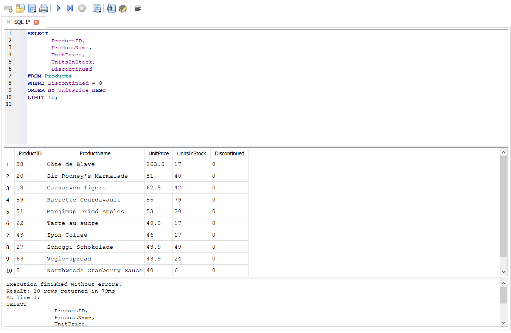
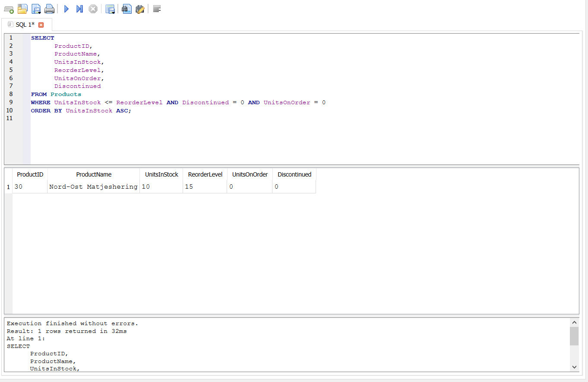
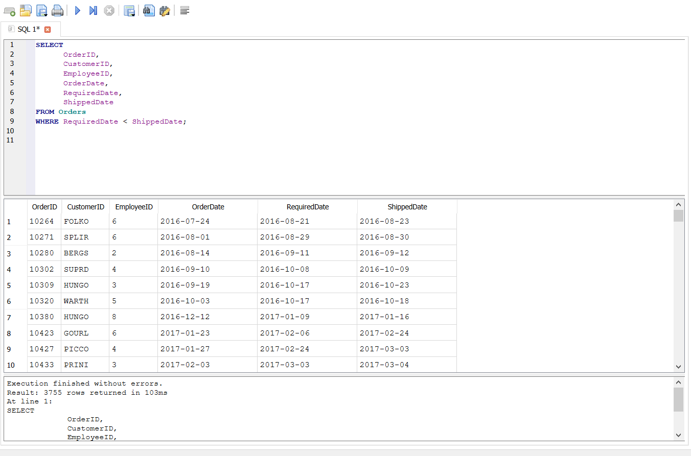
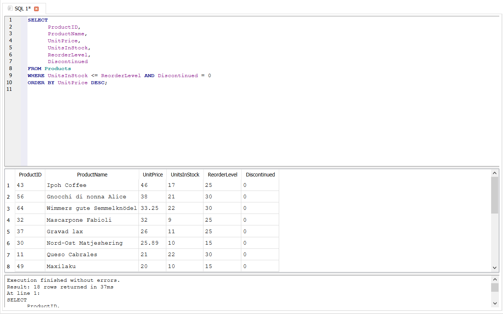
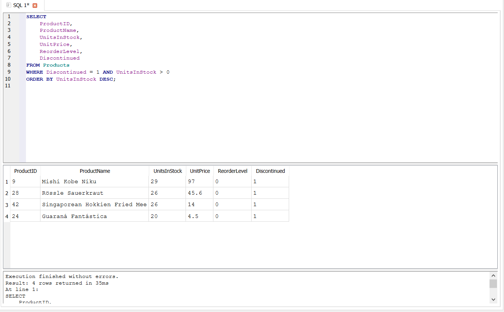
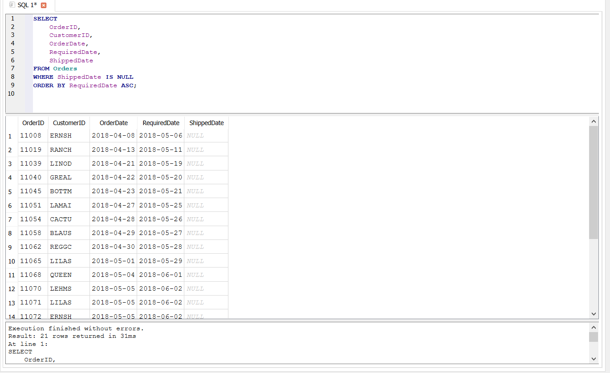

# 📊 Basic SQL Analysis – Analysis Notes

Bu bölmədə Northwind verilənlər bazası üzərində `SELECT`, `WHERE`, `ORDER BY` və `LIMIT` əmrlərindən istifadə etməklə 6 müxtəlif biznes sualı analiz edilmişdir.

Hər bir analiz zamanı həm texniki, həm də biznes yönümlü problemlər müəyyən edilmiş və mümkün həll yolları təqdim edilmişdir.

---

## 1. Hazırda satışda olan ən yüksək qiymətli 10 məhsul hansılardır?

### 🔍 Analizin məqsədi

Şirkətin hazırda satışda olan ən yüksək qiymətli məhsullarını müəyyən etmək və yüksək qiymətli məhsulların gəlir potensialını ilkin olaraq qiymətləndirmək.

### 🧩 İstifadə olunan yanaşma

- `SELECT` və `FROM` vasitəsilə `Products` cədvəlindən lazımi sütunlar seçildi.
- `WHERE Discontinued = 0` şərti ilə hazırda satışı davam edən məhsullar filtr edildi.
- `ORDER BY UnitPrice DESC` vasitəsilə məhsullar qiymətə görə azalan sıra ilə sıralandı.
- `LIMIT 10` vasitəsilə ən yüksək qiymətli ilk 10 məhsul müəyyən edildi.

### ⚠️ Qarşılaşılan texniki problem

İlkin sorğuda `WHERE Discontinued = 0` şərti istifadə edilmədikdə, satışdan çıxarılmış 3 məhsul da nəticəyə daxil olmuşdu. Bu isə yalnız hazırda satışda olan məhsulları analiz etmək məqsədinə uyğun deyildi.

### 🛠️ Texniki həll

Sorğuya `WHERE Discontinued = 0` şərti əlavə edilərək yalnız hazırda satışda olan məhsullar saxlanıldı.

### 💼 Biznes problemi

Məhsulun yüksək qiymətə malik olması onun avtomatik olaraq yüksək gəlir gətirdiyi anlamına gəlmir. Yüksək qiymət bəzi müştərilərin alış qərarına mənfi təsir göstərə bilər.

### 💡 Biznes həlli və tövsiyə

Yüksək qiymətli məhsullar üçün endirim kampaniyaları, xüsusi təkliflər və hədəf müştəri qruplarına yönəlmiş marketinq strategiyaları tətbiq edilə bilər. Bundan əlavə, real gəlir potensialını qiymətləndirmək üçün məhsulların satış həcmi də ayrıca analiz edilməlidir.

### 📸 Nəticə

Aşağıdakı nəticədə hazırda satışda olan ən yüksək qiymətli 10 məhsul göstərilir.

---

## 2. Hazırda stockda müəyyən edilmiş limitdən aşağı olan və yenidən sifariş tələb edən məhsullar hansılardır?

### 🔍 Analizin məqsədi

Stok səviyyəsi kritik həddə çatmış, lakin yenidən sifariş edilməmiş və hazırda satışda olan məhsulları müəyyən etmək.

### 🧩 İstifadə olunan yanaşma

- `Products` cədvəlindən məhsul və stokla bağlı lazımi sütunlar seçildi.
- `UnitsInStock <= ReorderLevel` şərti ilə stok səviyyəsi müəyyən edilmiş limitə çatmış və ya ondan aşağı olan məhsullar seçildi.
- `Discontinued = 0` şərti ilə yalnız hazırda satışda olan məhsullar saxlanıldı.
- `UnitsOnOrder = 0` şərti ilə yenidən sifariş edilməmiş məhsullar müəyyən edildi.
- `ORDER BY UnitsInStock ASC` vasitəsilə stokda ən az sayda qalan məhsullar əvvəlcə göstərildi.

### ⚠️ Qarşılaşılan texniki problem

İlkin olaraq yalnız `UnitsInStock <= ReorderLevel` şərtindən istifadə edilmişdi. Bu zaman satışdan çıxarılmış məhsullar da nəticəyə daxil olurdu.

Digər məqam olaraq, `UnitsOnOrder` sütununda `NULL` dəyərlərin olması ehtimalı nəzərə alındı. Bu datasetdə `NULL` dəyər olmadığı üçün əlavə şərt tətbiq edilmədi. Alternativ olaraq `UnitsOnOrder = 0 OR UnitsOnOrder IS NULL` yanaşmasından istifadə edilə bilər.

### 🛠️ Texniki həll

Sorğuya `Discontinued = 0` və `UnitsOnOrder = 0` şərtləri əlavə edilərək yalnız hazırda satışda olan və yenidən sifariş edilməmiş kritik stok səviyyəli məhsullar müəyyən edildi.

### 💼 Biznes problemi

Stok səviyyəsi kritik həddə çatan məhsullar vaxtında müəyyən edilmədikdə məhsul tükənməsi və satış prosesində fasilələr yarana bilər.

### 💡 Biznes həlli və tövsiyə

Stok səviyyələri mütəmadi olaraq izlənilməli və kritik həddə çatan məhsullar üçün vaxtında yenidən sifariş prosesi başladılmalıdır.

### 📸 Nəticə

Aşağıdakı nəticədə stok səviyyəsi müəyyən edilmiş limitdən aşağı olan və yenidən sifariş tələb edən məhsullar göstərilir.

---

## 3. Tələb olunan çatdırılma tarixindən gec göndərilən sifarişlər hansılardır?

### 🔍 Analizin məqsədi

Tələb olunan çatdırılma tarixindən sonra göndərilmiş sifarişləri müəyyən edərək logistika performansını qiymətləndirmək.

### 🧩 İstifadə olunan yanaşma

`Orders` cədvəlündən sifarişlə bağlı lazımi sütunlar seçildi və `WHERE RequiredDate < ShippedDate` şərti ilə tələb olunan tarixdən gec göndərilmiş sifarişlər müəyyən edildi.

Analiz nəticəsinə əsasən 16 282 sifarişdən 3 755-nin tələb olunan tarixdən gec göndərildiyi müəyyən edilmişdir. Bu, ümumi sifarişlərin təxminən 23%-ni təşkil edir.

### ⚠️ Qarşılaşılan texniki problem

`ShippedDate` sütununda `NULL` dəyərlər mövcuddur. `NULL` dəyərlərlə müqayisə nəticəsi `TRUE` olmadığı üçün həmin sifarişlər `RequiredDate < ShippedDate` şərtinə daxil edilmir.

### 🛠️ Texniki həll

Hələ göndərilməmiş sifarişləri ayrıca müəyyən etmək üçün `ShippedDate IS NULL` şərtindən istifadə edilə bilər.

Əgər göndərilməmiş sifarişlərin gecikib-gecikmədiyi müəyyən edilmək istənilərsə, `RequiredDate < DATE('now')` yanaşmasından istifadə edilə bilər.

Lakin dataset köhnə olduğuna görə `DATE('now')` ilə müqayisə zamanı həmin sifarişlərin hamısının gecikmiş hesab edilməsi real biznes vəziyyətini düzgün əks etdirməyə bilər.

### 💼 Biznes problemi

Yüksək gecikmə faizi müştəri məmnuniyyətinin azalmasına, sifarişlərin vaxtında çatdırılmamasına və şirkətin reputasiyasına mənfi təsir göstərə bilər.

### 💡 Biznes həlli və tövsiyə

Logistika proseslərinə nəzarət artırılmalı, gecikmələrin əsas səbəbləri müəyyən edilməli və sifarişlərin hazırlanması və göndərilməsi daha effektiv planlaşdırılmalıdır.

### 📸 Nəticə

Aşağıdakı nəticədə tələb olunan çatdırılma tarixindən gec göndərilən sifarişlər göstərilir.

---

## 4. Qiyməti yüksək, lakin stok səviyyəsi kritik olan məhsullar hansılardır?

### 🔍 Analizin məqsədi

Yüksək qiymətli və potensial olaraq yüksək gəlir gətirə biləcək məhsullar arasında stok çatışmazlığı riski olanları müəyyən etmək.

### 🧩 İstifadə olunan yanaşma

- `UnitsInStock <= ReorderLevel` şərti ilə stok səviyyəsi kritik həddə olan məhsullar seçildi.
- `Discontinued = 0` şərti ilə yalnız hazırda satışda olan məhsullar saxlanıldı.
- `ORDER BY UnitPrice DESC` vasitəsilə yüksək qiymətli məhsullar əvvəlcə göstərildi.

### 💼 Biznes problemi

Bahalı məhsulların stokda olmaması şirkət üçün daha yüksək potensial gəlir itkisinə səbəb ola bilər.

### 💡 Biznes həlli və tövsiyə

Stok səviyyələri mütəmadi izlənilməli və prioritet olaraq yüksək qiymətli məhsulların stok vəziyyətinə nəzarət edilməlidir. Kritik səviyyəyə çatan məhsullar üçün vaxtında yenidən sifariş prosesi başladılmalıdır.

### 📸 Nəticə

Aşağıdakı nəticədə yüksək qiymətli və stok səviyyəsi kritik olan məhsullar göstərilir.

---

## 5. Satışdan çıxarılan, amma hələ də stockda qalan məhsullar hansılardır?

### 🔍 Analizin məqsədi

Satışdan çıxarılmış, lakin anbarda hələ də stokda qalan məhsulları müəyyən etmək.

### 🧩 İstifadə olunan yanaşma

- `Discontinued = 1` şərti ilə satışdan çıxarılmış məhsullar seçildi.
- `UnitsInStock > 0` şərti ilə stokda hələ də məhsul qalanlar müəyyən edildi.
- `ORDER BY UnitsInStock DESC` vasitəsilə stokda ən çox qalan məhsullar əvvəlcə göstərildi.

Analiz nəticəsində stokda qalan və satışdan çıxarılmış 4 məhsul müəyyən edildi.

### 💼 Biznes problemi

Satışdan çıxarılmış məhsulların anbarda saxlanılması əlavə yer tutur, şirkətin kapitalını stokda bağlayır və saxlama xərclərinin yaranmasına səbəb ola bilər.

### 💡 Biznes həlli və tövsiyə

Bu məhsulların stokunu azaltmaq üçün endirim kampaniyaları, xüsusi təkliflər və digər satış strategiyaları tətbiq edilə bilər. Bununla yanaşı, anbar ehtiyatlarının mütəmadi təhlili aparılmalıdır.

### 📸 Nəticə

Aşağıdakı nəticədə satışdan çıxarılmış, lakin hələ də stokda qalan məhsullar göstərilir.

---

## 6. Göndərilmə vaxtı yaxınlaşan, amma hələ göndərilməyən sifarişlər hansılardır?

### 🔍 Analizin məqsədi

Hələ göndərilməmiş sifarişləri müəyyən etmək və çatdırılma tarixi yaxın olan sifarişlərə prioritet vermək.

### 🧩 İstifadə olunan yanaşma

- `Orders` cədvəlindən sifarişlə bağlı lazımi sütunlar seçildi.
- `WHERE ShippedDate IS NULL` şərti ilə hələ göndərilməmiş sifarişlər müəyyən edildi.
- `ORDER BY RequiredDate ASC` vasitəsilə çatdırılma tarixi ən yaxın olan sifarişlər əvvəlcə göstərildi.

Analiz nəticəsində 21 sifarişin hələ göndərilmədiyi müəyyən edilmişdir. Nəticələri prioritetləşdirmək üçün `LIMIT 10` istifadə edilərək çatdırılma tarixi ən yaxın olan ilk 10 sifariş seçilə bilər.

### 💼 Biznes problemi

Sifarişlərin vaxtında göndərilməməsi müştəri məmnuniyyətinin azalmasına və şirkətin satışlarına mənfi təsir göstərə bilər.

### 💡 Biznes həlli və tövsiyə

Çatdırılma tarixi yaxınlaşan sifarişlər prioritetləşdirilməli, onların hazırlanması və göndərilməsi daha effektiv idarə olunmalıdır. Bu yanaşma potensial gecikmələrin qarşısının alınmasına və müştəri məmnuniyyətinin artırılmasına kömək edə bilər.

### 📸 Nəticə

Aşağıdakı nəticədə hələ göndərilməmiş və çatdırılma tarixinə görə prioritetləşdirilmiş sifarişlər göstərilir.

---

## 📌 Ümumi nəticə

Bu bölmədə aparılan analizlər göstərir ki, sadə SQL əmrlərindən istifadə etməklə belə şirkətin məhsul, stok və sifariş idarəetməsi ilə bağlı mühüm biznes suallarına cavab tapmaq mümkündür.

Analizlər zamanı əsas diqqət yalnız nəticənin əldə edilməsinə deyil, həm də məlumatların düzgün filtrasiya edilməsinə, `NULL` dəyərlərin nəzərə alınmasına, satışdan çıxarılmış məhsulların analizdən düzgün şəkildə ayrılmasına və nəticələrin biznes baxımından şərh edilməsinə yönəldilmişdir.

Bu yanaşma SQL sorğularının texniki icrası ilə yanaşı, məlumatlardan biznes qərarlarının dəstəklənməsi üçün istifadə edilməsini nümayiş etdirir.
