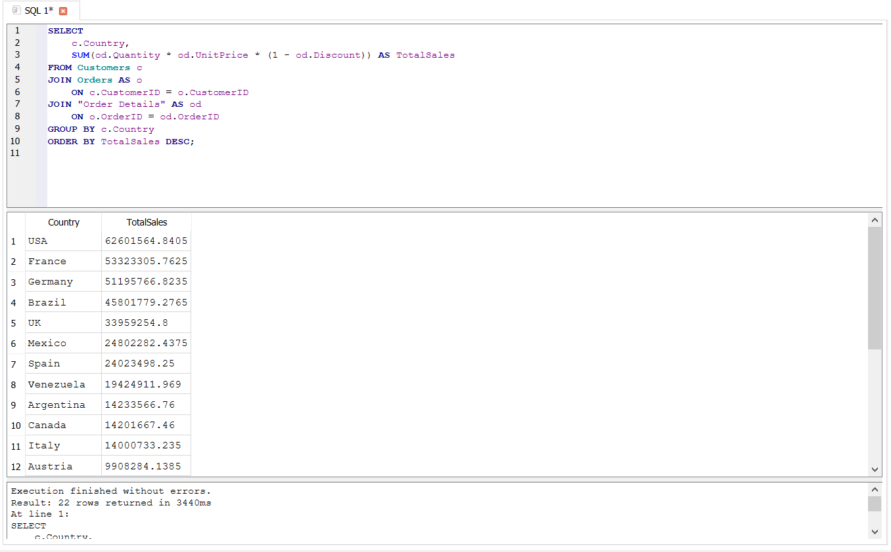
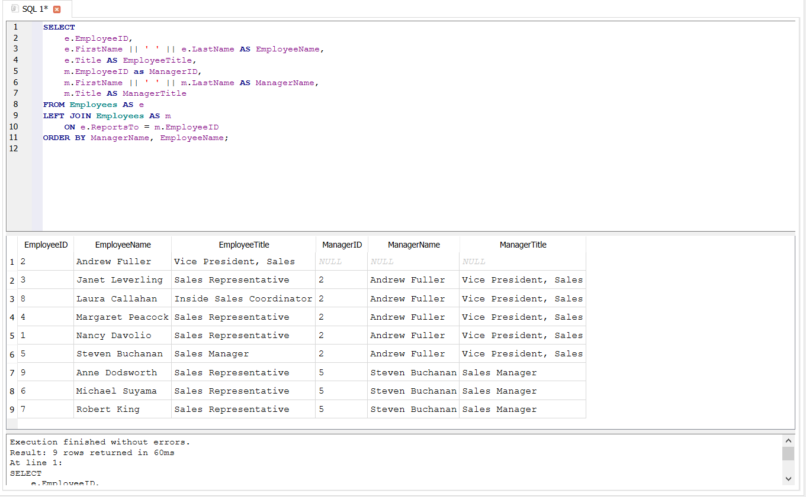
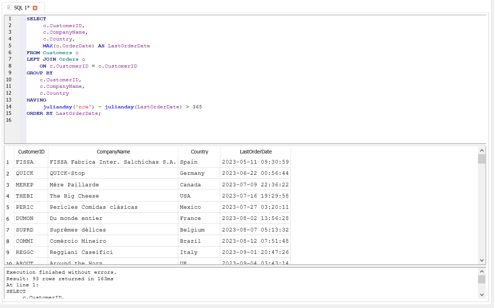

# 🔗 JOIN Analysis – Analysis Notes

Bu bölmədə Northwind verilənlər bazasında müxtəlif cədvəllər arasında əlaqələr qurularaq 3 müxtəlif biznes sualı analiz edilmişdir.

Analizlər zamanı INNER JOIN, LEFT JOIN və SELF JOIN yanaşmalarından istifadə edilmiş, həmçinin məlumatların düzgün aqreqasiyası və NULL dəyərlərin idarə olunması kimi texniki məsələlər nəzərdən keçirilmişdir.

---

## 1. Şirkətin ən çox satış etdiyi ölkələr hansılardır?

### 🔍 Analizin məqsədi

Şirkətin satışlarının hansı ölkələrdə daha yüksək olduğunu müəyyən etmək və satış fəaliyyətinin coğrafi bölgüsünü analiz etmək.

### 🧩 İstifadə olunan yanaşma

Analiz zamanı Customers, Orders və Order Details cədvəlləri arasında INNER JOIN əlaqəsi quruldu.

- Customers və Orders cədvəlləri CustomerID vasitəsilə əlaqələndirildi.
- Orders və Order Details cədvəlləri OrderID vasitəsilə əlaqələndirildi.
- Ümumi satış məbləğini hesablamaq üçün aşağıdakı düsturdan istifadə edildi:

SUM(od.Quantity * od.UnitPrice * (1 - od.Discount))

- GROUP BY c.Country vasitəsilə satışlar ölkələr üzrə qruplaşdırıldı.
- ORDER BY TotalSales DESC ilə ölkələr ümumi satış məbləğinə görə azalan sıra ilə sıralandı.

Analiz nəticəsində şirkətin ən çox satış etdiyi 3 ölkənin USA, France və Germany olduğu müəyyən edilmişdir.

### ⚠️ Qarşılaşılan texniki problem

JOIN əməliyyatları zamanı əsas risklərdən biri məlumatların yanlış şəkildə təkrarlanması və nəticədə aqreqasiya zamanı satış məbləğinin süni şəkildə şişirdilməsi ola bilər.

Bir sifarişdə bir neçə məhsul ola bildiyi üçün Orders və Order Details cədvəllərinin əlaqələndirilməsi zamanı hər sifariş üzrə məhsul sətirlərinin düzgün nəzərə alınması vacibdir.

Digər problem isə Customers cədvəlində iki müştərinin Country sütununda NULL dəyərinin olmasıdır. Bu müştərilərin satışları ayrıca NULL qrupu altında toplana bilər.

### 🛠️ Texniki həll

Satış məbləğinin düzgün hesablanması üçün Order Details səviyyəsində olan məhsul satışları düzgün şəkildə aqreqasiya edildi.

Əgər ölkəsi məlum olmayan müştərilər analizdən çıxarılmaq istənilərsə, əlavə olaraq aşağıdakı filtrdən istifadə edilə bilər:

WHERE c.Country IS NOT NULL

Lakin bu halda ölkəsi məlum olmayan müştərilərin satış məlumatları ümumi analizdən çıxarılmış olacaq. Buna görə belə bir filtr tətbiq etməzdən əvvəl biznes məqsədi nəzərə alınmalıdır.

### 💼 Biznes problemi

Satışların hansı ölkələrdə daha yüksək olduğunun müəyyən edilməməsi şirkətin regional satış strategiyalarının düzgün qurulmamasına səbəb ola bilər.

### 💡 Biznes həlli və tövsiyə

Yüksək satış göstəricilərinə malik ölkələrdə satış fəaliyyətinin genişləndirilməsi, regional anbarların və ya çatdırılma məntəqələrinin yaradılması nəzərdən keçirilə bilər.

Eyni zamanda yüksək satış göstərən ölkələrdə müştəri tələbatının səbəbləri araşdırılaraq uğurlu satış strategiyaları digər regionlarda da tətbiq edilə bilər.

### 📸 Nəticə

Aşağıdakı nəticədə şirkətin ölkələr üzrə ümumi satış məbləğləri göstərilir.

---

## 2. Şirkətdə hər bir işçi kimə hesabat verir və struktur necə qurulub?

### 🔍 Analizin məqsədi

Şirkətdə işçilərin kimə hesabat verdiyini müəyyən etmək və təşkilati rəhbərlik strukturunu analiz etmək.

### 🧩 İstifadə olunan yanaşma

Bu analizdə SELF JOIN yanaşmasından istifadə edilmişdir.

Employees cədvəli iki fərqli rol kimi istifadə edilmişdir:

- e — işçi
- m — menecer

İşçinin rəhbərini müəyyən etmək üçün aşağıdakı əlaqədən istifadə edilmişdir:

e.ReportsTo = m.EmployeeID

Burada Employees cədvəli öz-özü ilə əlaqələndirilir. Bunun səbəbi rəhbərlərin də digər işçilər kimi eyni Employees cədvəlində saxlanılmasıdır.

LEFT JOIN istifadə edilməsinin səbəbi isə rəhbəri olmayan işçinin də nəticədə saxlanılmasını təmin etməkdir.

Analiz nəticəsində 9 işçidən birinin Vice President vəzifəsində olduğu və digər işçilərin birbaşa və ya dolayı şəkildə rəhbərlərə hesabat verdiyi müəyyən edilmişdir.

### ⚠️ Qarşılaşılan texniki problem

Şirkətin rəhbərlik iyerarxiyasının yalnız bir cədvəldə saxlanılması məlumatların strukturunun düzgün başa düşülməsini tələb edir.

İlkin baxışda EmployeeID və ReportsTo sütunlarının əlaqəsi düzgün müəyyən edilmədikdə işçi-rəhbər münasibətlərini analiz etmək çətin ola bilər.

### 🛠️ Texniki həll

SELF JOIN istifadə edilərək Employees cədvəli öz-özü ilə əlaqələndirildi.

Bu yanaşma ilə:

- İşçinin adı və vəzifəsi
- Rəhbərinin adı və vəzifəsi
- İşçinin rəhbərinin EmployeeID-si

eyni nəticə cədvəlində göstərildi.

LEFT JOIN istifadə edildiyi üçün rəhbəri olmayan ən üst səviyyəli işçinin məlumatları da nəticədə saxlanıldı.

### 💼 Biznes problemi

Şirkət strukturunda işçilərin kimə tabe olduğunun aydın olmaması idarəetmə prosesində qarışıqlıq yarada bilər.

Bu vəziyyət hesabatlılığın, məsuliyyət bölgüsünün və iş proseslərinin düzgün idarə olunmasına mənfi təsir göstərə bilər.

### 💡 Biznes həlli və tövsiyə

İşçilər və rəhbərlər arasındakı hesabatlılıq əlaqələri mütəmadi olaraq nəzərdən keçirilməli və təşkilati struktur aydın şəkildə sənədləşdirilməlidir.

Bu məlumatlardan həmçinin təşkilati strukturun vizuallaşdırılması və rəhbərlik səviyyələrinin analizində istifadə edilə bilər.

### 📸 Nəticə

Aşağıdakı nəticədə işçilərin kimə hesabat verdiyi və rəhbərlik strukturu göstərilir.

---

## 3. Son 1 ildə sifariş verməyən müştərilər hansılardır?

### 🔍 Analizin məqsədi

Uzun müddətdir sifariş verməyən və aktivliyini itirmək riski olan müştəriləri müəyyən etmək.

### 🧩 İstifadə olunan yanaşma

Analiz zamanı Customers və Orders cədvəlləri arasında LEFT JOIN əlaqəsi quruldu.

LEFT JOIN istifadə edilməsinin əsas səbəbi bütün müştərilərin nəticədə saxlanılmasıdır. Beləliklə, heç bir sifariş verməmiş müştərilər də analizə daxil edilə bilər.

Bir müştərinin bir neçə sifarişi ola bildiyi üçün ən son sifariş tarixini müəyyən etmək məqsədilə:

MAX(o.OrderDate) AS LastOrderDate

istifadə edildi.

Daha sonra GROUP BY ilə müştərilər qruplaşdırıldı və HAVING vasitəsilə son sifarişindən 365 gündən çox vaxt keçən müştərilər müəyyən edildi.

### ⚠️ Qarşılaşılan texniki problem

Bir müştərinin bir neçə sifarişi ola bilər. Bu səbəbdən yalnız OrderDate sütununa əsaslanmaq müştərinin son aktivliyini düzgün müəyyən etməyə bilər.

Digər potensial problem OrderDate sütununda NULL dəyərlərin olmasıdır. Dataset yoxlanıldıqda belə dəyərlərin olmadığı müəyyən edilmişdir.

### 🛠️ Texniki həll

Hər bir müştərinin ən son sifariş tarixini tapmaq üçün MAX(o.OrderDate) funksiyasından istifadə edildi.

Daha sonra aşağıdakı şərtlə son sifarişindən 365 gündən çox vaxt keçən müştərilər filtr edildi:

julianday('now') - julianday(LastOrderDate) > 365

LEFT JOIN istifadə edilməsi bütün müştərilərin analizə daxil edilməsinə imkan verir.

### 💼 Biznes problemi

Müştərilərin uzun müddət sifariş verməməsi onların şirkəti itirmə riskinin artdığını göstərə bilər.

Bu vəziyyət şirkətin gəlirlərinin azalmasına və müştəri bazasının zəifləməsinə səbəb ola bilər.

### 💡 Biznes həlli və tövsiyə

Uzun müddət aktiv olmayan müştərilər ayrıca seqment kimi müəyyən edilməli və onların yenidən aktivləşdirilməsi üçün hədəfli strategiyalar hazırlanmalıdır.

Bu müştərilərə xüsusi endirimlər, fərdi təkliflər, loyallıq proqramları, yenidən aktivləşdirmə kampaniyaları

təqdim edilə bilər.

Müştəri aktivliyinin mütəmadi izlənilməsi potensial müştəri itkisini əvvəlcədən müəyyən etməyə və qarşısını almağa kömək edə bilər.

### 📸 Nəticə

Aşağıdakı nəticədə son 1 ildə sifariş verməyən müştərilər göstərilir.

---

## 📌 Ümumi nəticə

Bu bölmədə INNER JOIN, LEFT JOIN və SELF JOIN istifadə edilərək Northwind verilənlər bazasındakı müxtəlif cədvəllər arasında əlaqələr qurulmuş və biznes yönümlü analizlər aparılmışdır.

Analizlər göstərir ki, JOIN əməliyyatlarının düzgün seçilməsi və tətbiqi məlumatların düzgün birləşdirilməsi üçün əsas əhəmiyyət daşıyır.

Bu bölmədə həmçinin:

- Müxtəlif cədvəllər arasında əlaqələrin qurulması
- SELF JOIN ilə iyerarxik strukturun analiz edilməsi
- LEFT JOIN ilə məlumat itkisinin qarşısının alınması
- MAX() ilə son aktivliyin müəyyən edilməsi
- GROUP BY və HAVING ilə qruplaşdırılmış nəticələrin filtrasiya edilməsi
- Məlumat keyfiyyəti və NULL dəyərlərin nəzərə alınması

kimi yanaşmalar tətbiq edilmişdir.

Nəticədə SQL sorğularından istifadə etməklə yalnız məlumatları birləşdirmək deyil, həm də şirkətin satış coğrafiyası, təşkilati strukturu və müştəri aktivliyi haqqında biznes baxımından əhəmiyyətli nəticələr əldə edilmişdir.
