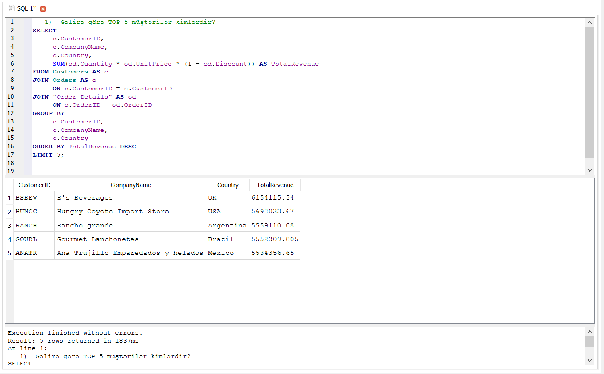
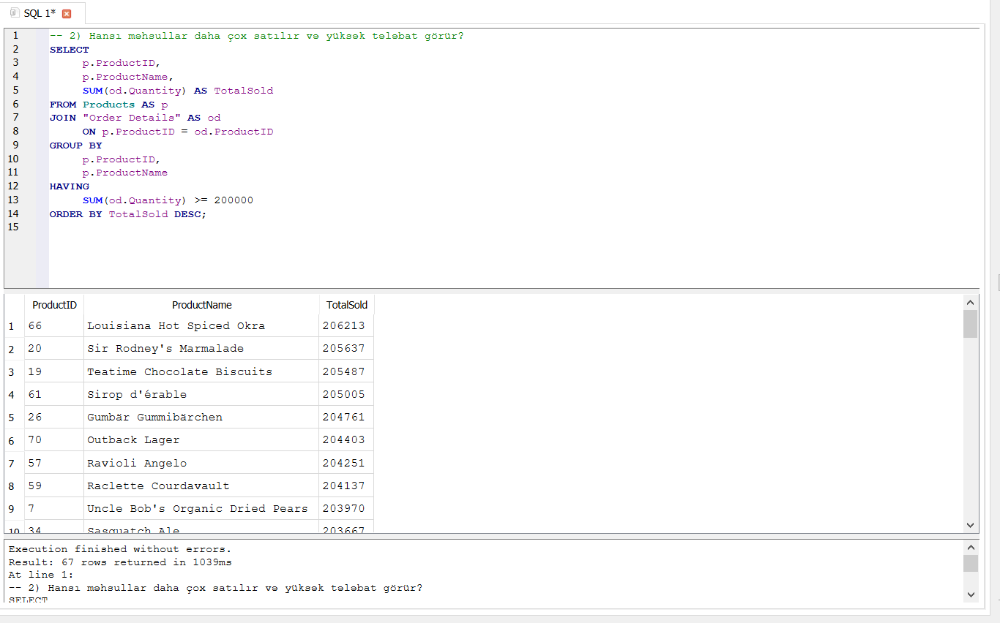

# 📊 Aggregation Analysis – Analysis Notes

Bu bölmədə Northwind verilənlər bazası üzərində GROUP BY, HAVING və aqreqasiya funksiyalarından istifadə edilərək 2 müxtəlif biznes sualı analiz edilmişdir.

Analizlər zamanı müştərilərin şirkət gəlirinə töhfəsi və məhsullara olan tələbat araşdırılmış, yüksək gəlir gətirən müştərilər və yüksək satış həcminə malik məhsullar müəyyən edilmişdir.

---

## 1. Gəlirə görə TOP 5 müştərilər kimlərdir?

### 🔍 Analizin məqsədi

Şirkətə ən çox gəlir gətirən TOP 5 müştərini müəyyən etmək və yüksək dəyər yaradan müştərilərin biznes üçün əhəmiyyətini qiymətləndirmək.

### 🧩 İstifadə olunan yanaşma

Analiz zamanı Customers, Orders və Order Details cədvəlləri arasında əlaqə quruldu.

- Customers və Orders cədvəlləri CustomerID vasitəsilə əlaqələndirildi.
- Orders və Order Details cədvəlləri OrderID vasitəsilə əlaqələndirildi.
- Hər bir müştərinin ümumi gəlirini hesablamaq üçün bu düsturdan istifadə edildi: SUM(od.Quantity * od.UnitPrice * (1 - od.Discount))

- GROUP BY vasitəsilə müştərilər üzrə qruplaşdırma aparıldı.
- ORDER BY TotalRevenue DESC ilə müştərilər ümumi gəlirə görə azalan sıra ilə sıralandı.
- LIMIT 5 istifadə edilərək ən yüksək gəlir gətirən TOP 5 müştəri müəyyən edildi.

Analiz nəticəsində şirkətə ən çox gəlir gətirən TOP 5 müştərinin B's Beverages, Hungry Coyote Import Store, Rancho grande, Gourmet Lanchonetes və Ana Trujillo Emparedados y helados olduğu müəyyən edilmişdir.

### ⚠️ Qarşılaşılan texniki problem

Şirkətin çoxlu sayda müştərisi olduğu üçün bütün müştərilərin gəlirə töhfəsini ayrı-ayrılıqda analiz etmək çətin ola bilər.

Digər texniki risk isə JOIN əməliyyatları zamanı məlumatların yanlış aqreqasiya edilərək nəticənin süni şəkildə şişirdilməsi ola bilər.

Bir müştərinin bir neçə sifarişi, bir sifarişin isə bir neçə məhsulu ola bildiyi üçün cədvəllər arasındakı əlaqələrin düzgün qurulması vacibdir.

### 🛠️ Texniki həll

Müştərilərin ümumi gəlirini düzgün hesablamaq üçün Customers, Orders və Order Details cədvəlləri arasında düzgün JOIN əlaqələri quruldu.

Daha sonra GROUP BY vasitəsilə hər bir müştərinin satışları qruplaşdırıldı və SUM() funksiyası ilə ümumi gəlir hesablandı.

Nəticələr ORDER BY ilə azalan sıra ilə sıralanaraq LIMIT 5 vasitəsilə yalnız ən yüksək gəlir gətirən 5 müştəri seçildi.

### 💼 Biznes problemi

Şirkətin bütün müştərilərə eyni yanaşması düzgün olmaya bilər. Çünki bəzi müştərilər şirkətin gəlirinin əhəmiyyətli hissəsini formalaşdıra bilər.

Yüksək gəlir gətirən müştərilərin müəyyən edilməməsi həmin müştərilərlə əlaqələrin düzgün idarə olunmamasına və potensial gəlir itkisinə səbəb ola bilər.

### 💡 Biznes həlli və tövsiyə

Yüksək gəlir gətirən müştərilər şirkət üçün prioritet müştəri seqmenti kimi qiymətləndirilə bilər.

Bu müştərilərlə uzunmüddətli əməkdaşlığın qorunması üçün fərdi yanaşma, xüsusi təkliflər, loyallıq proqramları, fərdiləşdirilmiş xidmətlər, müştəri əlaqələrinin gücləndirilməsi kimi strategiyalardan istifadə edilə bilər.

### 📸 Nəticə

Aşağıdakı nəticədə şirkətə ən çox gəlir gətirən TOP 5 müştəri göstərilir.

---

## 2. Hansı məhsullar daha çox satılır və yüksək tələbat görür?

### 🔍 Analizin məqsədi

Şirkətin ən çox satılan və yüksək tələbat görən məhsullarını müəyyən etmək və bu məhsulların stok və satış strategiyalarında prioritetləşdirilməsini qiymətləndirmək.

### 🧩 İstifadə olunan yanaşma

Analiz zamanı Products və Order Details cədvəlləri ProductID vasitəsilə əlaqələndirildi.

- SUM(od.Quantity) vasitəsilə hər bir məhsulun ümumi satış miqdarı hesablandı.
- GROUP BY istifadə edilərək məhsullar üzrə qruplaşdırma aparıldı.
- HAVING SUM(od.Quantity) >= 200000 vasitəsilə ümumi satış miqdarı 200 000 və daha çox olan məhsullar seçildi.
- ORDER BY TotalSold DESC ilə məhsullar satış həcminə görə azalan sıra ilə sıralandı.

200 000 ədədlik limit yüksək tələbatlı məhsulları müəyyən etmək üçün seçilmiş analitik meyardır.

Analiz nəticəsində ən çox satılan ilk 3 məhsulun Louisiana Hot Spiced Okra, Sir Rodney's Marmalade və Teatime Chocolate Biscuits olduğu müəyyən edilmişdir.

### ⚠️ Qarşılaşılan texniki problem

Yüksək tələbat görən məhsulların müəyyən edilməməsi şirkətin stok idarəetməsində problemlərə səbəb ola bilər.

Əlavə olaraq, yüksək satış həcminin hansı səviyyədə "yüksək tələbat" hesab edilməsinin müəyyənləşdirilməsi analizin əsas məsələlərindən biridir.

### 🛠️ Texniki həll

Məhsulların satış həcmini müəyyən etmək üçün SUM(od.Quantity) aqreqasiya funksiyasından istifadə edildi.

GROUP BY ilə hər bir məhsul üzrə satış miqdarı hesablandı.

Daha sonra HAVING istifadə edilərək yalnız satış miqdarı 200 000 və daha çox olan məhsullar nəticədə saxlanıldı.

Bu yanaşma WHERE əvəzinə HAVING istifadəsinin praktik nümunəsidir. Çünki filtrasiya aqreqasiya nəticəsində yaranan SUM() dəyərinə tətbiq edilir.

### 💼 Biznes problemi

Yüksək tələbat görən məhsulların əvvəlcədən müəyyən edilməməsi stokların tükənməsinə və müştəri sifarişlərinin gecikməsinə səbəb ola bilər.

Bu vəziyyət həm müştəri məmnuniyyətinə, həm də şirkətin gəlirlərinə mənfi təsir göstərə bilər.

### 💡 Biznes həlli və tövsiyə

Yüksək tələbat görən məhsulların stok səviyyələri mütəmadi olaraq izlənilməlidir.

Bu məhsullar üçün stok səviyyələrinin prioritet monitorinqi, vaxtında yenidən sifariş verilməsi, tələbat proqnozlarının hazırlanması, satış və marketinq strategiyalarının tətbiqi
nəzərdən keçirilə bilər.

Eyni zamanda 200 000 ədədlik limit nümunəvi analitik meyardır və real biznes mühitində məhsul kateqoriyasına, satış dövrünə və tarixi tələbat göstəricilərinə əsasən dəyişdirilə bilər.

### 📸 Nəticə

Aşağıdakı nəticədə yüksək satış həcminə və tələbat göstəricisinə malik məhsullar göstərilir.

---

## 📌 Ümumi nəticə

Bu bölmədə GROUP BY, HAVING, SUM() və LIMIT istifadə edilərək müştəri gəlirləri və məhsul satışları analiz edilmişdir.

Analizlər nəticəsində şirkət üçün yüksək dəyər yaradan müştərilər və yüksək tələbat görən məhsullar müəyyən edilmişdir.

Bu analizlər göstərir ki, aqreqasiya funksiyalarından istifadə etməklə böyük həcmli məlumatlardan biznes qərarlarını dəstəkləyən nəticələr əldə etmək mümkündür.

Yüksək gəlir gətirən müştərilərin müəyyən edilməsi müştəri münasibətlərinin idarə olunmasına, yüksək tələbatlı məhsulların müəyyən edilməsi isə stok və satış proseslərinin daha effektiv planlaşdırılmasına kömək edə bilər.
