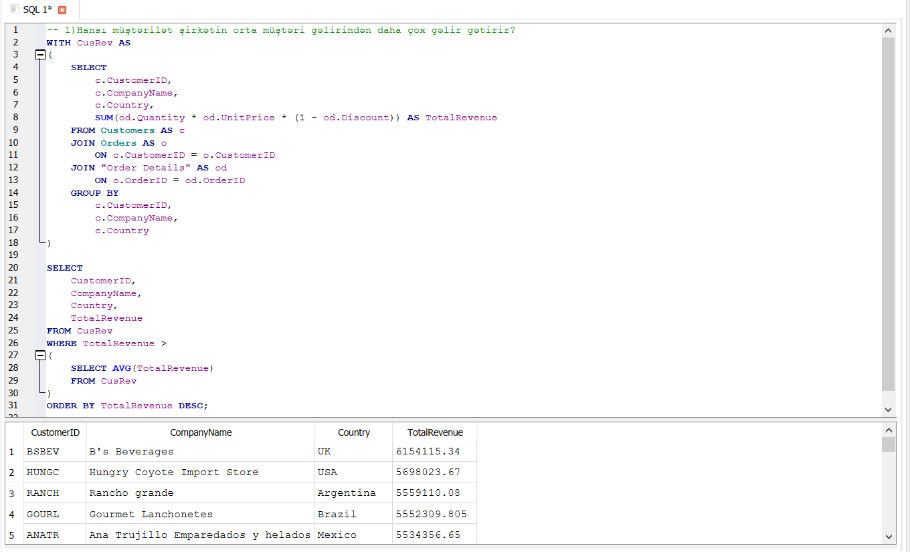

# 🔎 Subquery & CTE Analysis – Analysis Notes

Bu bölmədə Northwind verilənlər bazası üzərində CTE və Subquery istifadə edilərək şirkətin orta müştəri gəlirindən daha çox gəlir gətirən müştərilər müəyyən edilmişdir.

---

## 1. Hansı müştərilər şirkətin orta müştəri gəlirindən daha çox gəlir gətirir?

### 🔍 Analizin məqsədi

Şirkətin orta müştəri gəlirindən daha çox gəlir gətirən müştəriləri müəyyən etmək və yüksək gəlir yaradan müştərilərin biznes üçün əhəmiyyətini qiymətləndirmək.

### 🧩 İstifadə olunan yanaşma

Analiz zamanı əvvəlcə CTE yaradılaraq hər bir müştərinin ümumi gəliri hesablandı.

Customers, Orders və Order Details cədvəlləri arasında əlaqə quruldu.

Hər bir müştərinin ümumi gəlirini hesablamaq üçün bu düsturdan istifadə edildi: SUM(od.Quantity * od.UnitPrice * (1 - od.Discount))

CTE daxilində GROUP BY istifadə edilərək hər bir müştəri üzrə ümumi gəlir hesablandı.

Daha sonra əsas sorğuda Subquery istifadə edilərək bütün müştərilərin orta gəliri müəyyən edildi: SELECT AVG(TotalRevenue) FROM CusRev

Əsas sorğuda WHERE şərti vasitəsilə yalnız ümumi gəliri orta müştəri gəlirindən yüksək olan müştərilər seçildi.

Nəticələr TotalRevenue göstəricisinə əsasən azalan sıra ilə sıralandı.

### 🧠 CTE-nin istifadəsinin səbəbi

CTE vasitəsilə müştərilərin ümumi gəlirini hesablayan ara nəticə yaradıldı.

Bu yanaşma kompleks sorğunun daha oxunaqlı və strukturlaşdırılmış formada yazılmasına imkan verir.

Əvvəlcə hər bir müştərinin gəliri hesablanır, daha sonra həmin nəticə üzərində orta gəlir hesablanaraq müştərilər müqayisə edilir.

Bu yanaşma xüsusilə çoxmərhələli analitik sorğuların daha aydın və idarəolunan şəkildə qurulmasına kömək edir.

### 🔍 Subquery-nin istifadəsinin səbəbi

Subquery vasitəsilə CTE-də hesablanmış bütün müştərilərin orta gəliri müəyyən edildi.

Daha sonra əsas sorğu bu orta göstəricidən istifadə edərək yalnız orta gəlirdən daha çox gəlir gətirən müştəriləri filtr etdi.

Beləliklə, iki mərhələli analiz aparıldı:

1. Hər bir müştərinin ümumi gəliri hesablandı.
2. Müştərilərin ümumi gəliri orta gəlirlə müqayisə edildi.

### 💼 Biznes problemi

Şirkət üçün yüksək gəlir yaradan müştərilərin müəyyən edilməməsi həmin müştərilərlə əlaqələrin düzgün idarə olunmamasına və potensial gəlir itkisinə səbəb ola bilər.

Bütün müştərilərə eyni yanaşmaq effektiv olmaya bilər. Çünki bəzi müştərilər şirkətin orta müştəri gəlirindən əhəmiyyətli dərəcədə daha çox gəlir yarada bilər.

### 💡 Biznes həlli və tövsiyə

Orta müştəri gəlirindən daha çox gəlir gətirən müştərilər yüksək dəyərli müştəri seqmenti kimi qiymətləndirilə bilər.

Bu müştərilər üçün fərdi yanaşma, loyallıq proqramları, xüsusi endirim və təkliflər, fərdiləşdirilmiş xidmətlər, uzunmüddətli əməkdaşlıq strategiyaları
tətbiq edilə bilər.

Şirkət bu müştərilərin davranışlarını mütəmadi izləyərək onların şirkət üçün yaratdığı dəyəri qorumağa və artırmağa çalışa bilər.

### 📸 Nəticə

Aşağıdakı nəticədə şirkətin orta müştəri gəlirindən daha çox gəlir gətirən müştərilər göstərilir.

---

## 📌 Ümumi nəticə

Bu analizdə CTE və Subquery birlikdə istifadə edilərək çoxmərhələli analitik yanaşma tətbiq edilmişdir.

Əvvəlcə hər bir müştərinin ümumi gəliri hesablanmış, daha sonra bütün müştərilər üzrə orta gəlir müəyyən edilmiş və bu göstəricidən daha yüksək gəlir gətirən müştərilər seçilmişdir.

Bu yanaşma məlumatların mərhələli şəkildə analiz edilməsinə və biznes üçün yüksək dəyər yaradan müştərilərin müəyyən edilməsinə imkan verir.

Nəticələr şirkətin müştəri seqmentasiyası, loyallıq strategiyaları və gəlir artımına yönəlmiş qərarların qəbul edilməsində istifadə oluna bilər.
