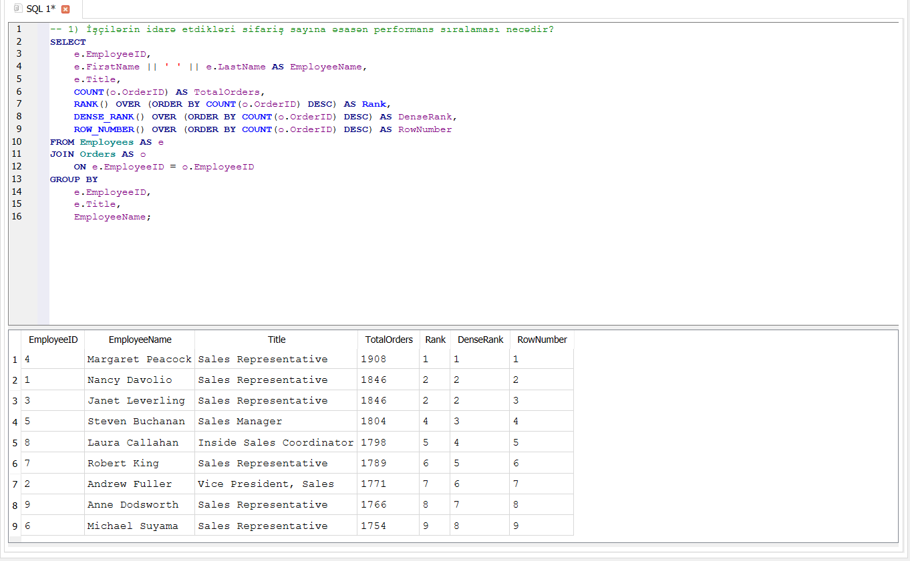

# 📊 Window Functions Analysis – Analysis Notes

Bu bölmədə Northwind verilənlər bazası üzərində Window Functions istifadə edilərək işçilərin idarə etdikləri sifariş sayına əsasən performans sıralaması analiz edilmişdir.

Analiz zamanı RANK(), DENSE_RANK() və ROW_NUMBER() funksiyalarının fərqləri müqayisə edilmiş və eyni nəticəyə malik işçilərin sıralanmasının necə dəyişdiyi araşdırılmışdır.

---

## 1. İşçilərin idarə etdikləri sifariş sayına əsasən performans sıralaması necədir?

### 🔍 Analizin məqsədi

Şirkətdə hər bir işçinin idarə etdiyi sifarişlərin sayını müəyyən etmək və işçiləri idarə etdikləri sifariş sayına əsasən sıralamaq.

Eyni zamanda RANK(), DENSE_RANK() və ROW_NUMBER() Window Functions funksiyalarının sıralama zamanı davranış fərqlərini müqayisə etmək.

### 🧩 İstifadə olunan yanaşma

Analiz zamanı Employees və Orders cədvəlləri EmployeeID vasitəsilə əlaqələndirildi.

COUNT(o.OrderID) istifadə edilərək hər bir işçinin idarə etdiyi ümumi sifariş sayı hesablandı.

GROUP BY vasitəsilə məlumatlar hər bir işçi üzrə qruplaşdırıldı.

Daha sonra üç fərqli Window Function istifadə edilərək işçilərin sıralaması müəyyən edildi:

- RANK()
- DENSE_RANK()
- ROW_NUMBER()

Hər üç funksiya işçilərin idarə etdikləri sifariş sayına əsasən azalan sıra ilə tətbiq edildi.

### 🧠 Window Functions funksiyalarının fərqi

#### RANK()

RANK() eyni nəticəyə malik işçilərə eyni sıralama nömrəsini verir.

Əgər iki və ya daha çox işçi eyni sayda sifariş idarə edirsə, onlar eyni rank əldə edir.

Bu zaman növbəti sıralamada boşluq yaranır.

Məsələn:

1
2
2
4

Burada 3-cü sıra nömrəsi atlanır.

---

#### DENSE_RANK()

DENSE_RANK() də eyni nəticəyə malik işçilərə eyni sıralama nömrəsini verir.

Lakin RANK() funksiyasından fərqli olaraq növbəti sıralamada boşluq yaratmır.

Məsələn:

1
2
2
3

Bu səbəbdən DENSE_RANK() ardıcıl sıralamanın qorunması tələb olunan hallarda istifadə edilə bilər.

---

#### ROW_NUMBER()

ROW_NUMBER() hər bir sətrə unikal sıra nömrəsi verir.

İki işçinin idarə etdiyi sifariş sayı eyni olsa belə, onlar fərqli sıra nömrələri alırlar.

Məsələn:

1
2
3
4

Bu səbəbdən ROW_NUMBER() hər bir nəticəyə unikal sıra nömrəsi vermək tələb olunan hallarda istifadə edilə bilər.

### 💼 Biznes problemi

İşçilərin idarə etdiyi sifariş sayı və performans fərqləri müəyyən edilmədikdə iş yükünün düzgün bölüşdürülməməsi və resursların səmərəsiz istifadəsi mümkündür.

Həmçinin işçilər arasında performans fərqlərinin görünməməsi rəhbərliyin resurs planlaşdırılması və iş bölgüsü ilə bağlı qərarlarını çətinləşdirə bilər.

### 💡 Biznes həlli və tövsiyə

İşçilərin idarə etdikləri sifariş sayı analiz edilərək iş yükünün daha balanslı bölüşdürülməsi mümkündür.

Yüksək performans göstərən əməkdaşların iş prosesində tətbiq etdiyi effektiv yanaşmalar digər əməkdaşlarla paylaşılaraq ümumi komanda performansının artırılmasına dəstək verilə bilər.

Bununla yanaşı, sifariş sayı işçi performansının yalnız bir göstəricisidir. Daha düzgün performans qiymətləndirilməsi üçün sifarişlərin vaxtında idarə olunması, satış gəliri, müştəri məmnuniyyəti və digər KPI göstəriciləri də nəzərə alınmalıdır.

### 📸 Nəticə

Aşağıdakı nəticədə işçilərin idarə etdikləri sifariş sayı və RANK(), DENSE_RANK() və ROW_NUMBER() funksiyaları ilə hesablanmış sıralama göstəriciləri təqdim olunur.

---

## 📌 Ümumi nəticə

Bu analizdə Window Functions istifadə edilərək işçilərin idarə etdikləri sifariş sayına əsasən performans sıralaması aparılmışdır.

RANK(), DENSE_RANK() və ROW_NUMBER() funksiyalarının eyni məlumat üzərində fərqli nəticələr yaratdığı müşahidə edilmişdir.

Bu yanaşma Window Functions funksiyalarının praktiki istifadəsini göstərməklə yanaşı, biznes məlumatlarının daha ətraflı analiz edilməsinə və müxtəlif sıralama strategiyalarının tətbiqinə imkan verir.

Nəticələr iş yükünün bölüşdürülməsi, resurs planlaşdırılması və işçi performansının ilkin qiymətləndirilməsində istifadə edilə bilər.
