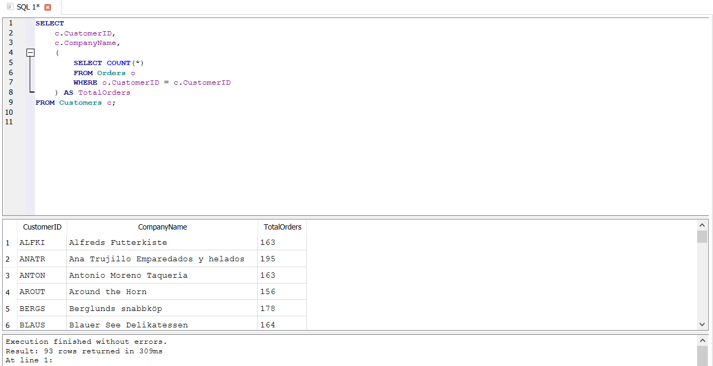
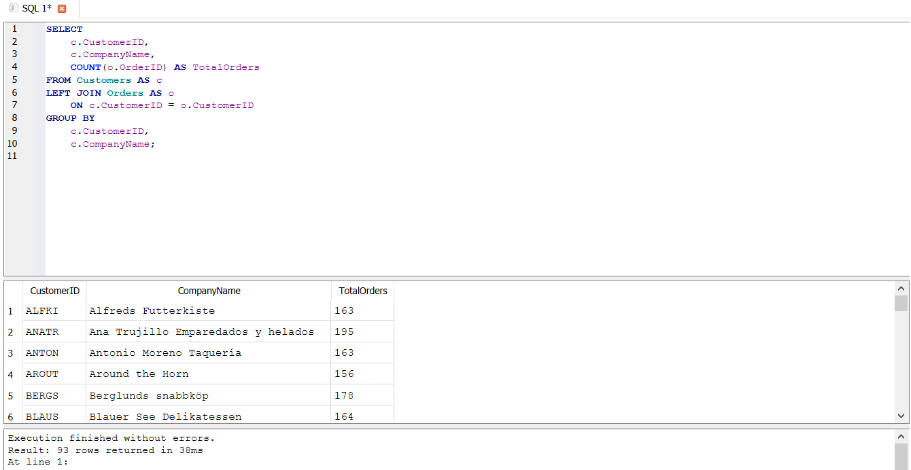

# ⚡ Query Optimization – Analysis Notes

Bu bölmədə Northwind verilənlər bazası üzərində SQL sorğularının optimallaşdırılması ilə bağlı nümunələr analiz edilmişdir.

Analiz zamanı INDEX istifadəsi və Correlated Subquery ilə JOIN yanaşmalarının performans fərqləri araşdırılmışdır.

Məqsəd sorğuların daha effektiv icra olunması, performans problemlərinin müəyyən edilməsi və alternativ optimallaşdırma üsullarının müqayisə edilməsidir.

## 1. INDEX istifadə edərək sorğunun optimallaşdırılması

INDEX verilənlər bazasında müəyyən sütunlar üzrə məlumatlara daha sürətli çıxış imkanı yaradan xüsusi verilənlər strukturudur.

INDEX-i kitabın mündəricatına bənzətmək olar. Mündəricat olmadan kitabda müəyyən mövzunu tapmaq üçün səhifələri ardıcıl şəkildə nəzərdən keçirmək lazım gələ bilər. Mündəricat olduqda isə axtarılan mövzuya daha sürətli keçid etmək mümkündür.

Verilənlər bazasında da INDEX uyğun axtarışlarda məlumatların daha sürətli tapılmasına kömək edə bilər.

### 📌 INDEX istifadəsinin üstünlükləri

* Axtarış əməliyyatlarının sürətlənməsinə kömək edə bilər.
* Böyük həcmli məlumatlarda müəyyən sütunlar üzrə filtrasiya prosesini optimallaşdıra bilər.
* Tez-tez axtarış aparılan sütunlarda performansın yaxşılaşdırılmasına imkan verə bilər.

### ⚠️ INDEX istifadəsinin mənfi tərəfləri

INDEX-lərin çox sayda yaradılması həmişə yaxşı nəticə vermir.

INDEX əlavə yaddaş tələb edir və INSERT, UPDATE və DELETE kimi DML əməliyyatlarının performansına mənfi təsir göstərə bilər. Çünki məlumat dəyişdirildikdə INDEX strukturlarının da yenilənməsi lazım gəlir.

Buna görə INDEX-lər yalnız real ehtiyac olduqda və sorğuların icra planı analiz edildikdən sonra yaradılmalıdır.

## 2. Correlated Subquery və JOIN performans müqayisəsi

### 🔍 Analizin məqsədi

Hər bir müştərinin ümumi sifariş sayını hesablamaq üçün Correlated Subquery və JOIN yanaşmalarını müqayisə etmək və performans fərqini müəyyən etmək.

### 2.1. Correlated Subquery yanaşması

İlk olaraq hər bir müştərinin sifariş sayını hesablamaq üçün Correlated Subquery istifadə edildi.

### ⚠️ Qarşılaşılan texniki problem

Correlated Subquery xarici sorğunun hər sətri üçün əlaqəli daxili sorğunu yenidən icra edə bilər.

Məlumat həcmi artdıqca bu yanaşma sorğunun performansına mənfi təsir göstərə və icra müddətinin artmasına səbəb ola bilər.

Bu dataset üzrə Correlated Subquery ilə yazılmış sorğunun icra müddəti 309 ms olmuşdur.

### 🛠️ Texniki həll

Alternativ yanaşma olaraq Correlated Subquery JOIN ilə əvəz edildi.

### 2.2. JOIN yanaşması

Eyni nəticəni əldə etmək üçün JOIN və GROUP BY istifadə edildi.

Bu yanaşmada Customers və Orders cədvəlləri CustomerID vasitəsilə əlaqələndirildi.

Daha sonra COUNT() istifadə edilərək hər bir müştərinin sifariş sayı hesablandı.

Bu sorğunun icra müddəti 38 ms olmuşdur.

### 📊 Performans müqayisəsi

| Yanaşma             | İcra müddəti |
| ------------------- | -----------: |
| Correlated Subquery |       309 ms |
| JOIN                |       38 ms |

Bu dataset üzrə JOIN yanaşması Correlated Subquery ilə müqayisədə təxminən 8.1 dəfə daha sürətli nəticə vermişdir.

Hesablama:

309 / 38 ≈ 8.1

Bu nəticəyə əsasən, bu dataset üçün JOIN yanaşması daha performanslı alternativ olmuşdur.

### ⚠️ Vacib qeyd

Bu nəticə konkret dataset və istifadə olunan mühit üzrə əldə edilmiş performans göstəricisidir.

Fərqli verilənlər bazası sistemlərində, dataset ölçülərində və execution plan-larda nəticələr dəyişə bilər.

Buna görə optimallaşdırma qərarı yalnız nəzəri yanaşmaya deyil, real icra müddətinin və execution plan-ın müqayisəsinə əsaslanmalıdır.

## 3. Correlated Subquery əvəzinə JOIN istifadəsinin səbəbi

Correlated Subquery kiçik datasetlərdə və müəyyən hallarda effektiv işləyə bilər.

Lakin məlumat həcmi artdıqca xarici sorğunun hər sətri üçün daxili sorğunun təkrar icra olunması potensial performans probleminə səbəb ola bilər.

JOIN yanaşması isə əlaqəli məlumatların birləşdirilərək aqreqasiya edilməsinə imkan verir.

Bu analizdə JOIN yanaşmasının 38 ms , Correlated Subquery yanaşmasının isə 309 ms nəticə göstərməsi JOIN-in bu dataset üzrə daha effektiv alternativ olduğunu göstərmişdir.

## 4. Sorğuların optimallaşdırılması üçün digər yanaşmalar

Sorğuların optimallaşdırılması yalnız INDEX və JOIN istifadəsi ilə məhdudlaşmır.

Performansı yaxşılaşdırmaq üçün konkret vəziyyətdən asılı olaraq aşağıdakı yanaşmalardan da istifadə edilə bilər:

* Lazımsız sütunlar əvəzinə yalnız tələb olunan sütunların seçilməsi
* Lazımsız DISTINCT istifadəsindən qaçınmaq
* Uyğun hallarda IN əvəzinə EXISTS istifadəsini qiymətləndirmək
* Correlated Subquery əvəzinə JOIN və ya digər alternativ yanaşmaları müqayisə etmək
* WHERE şərtlərinin effektiv istifadəsi
* INDEX-lərin düzgün sütunlarda yaradılması
* Execution plan-ın analiz edilməsi
* Sorğunun real icra müddətinin ölçülməsi

Hər bir optimallaşdırma üsulunun effektivliyi konkret sorğuya, məlumat həcminə, INDEX-lərə və istifadə olunan verilənlər bazası sisteminə görə dəyişə bilər.

## 5. Cost və Execution Plan

Sorğuların optimallaşdırılması zamanı Cost və Execution Plan anlayışları da əhəmiyyətlidir.

Execution Plan verilənlər bazası sisteminin sorğunu hansı addımlarla icra etdiyini göstərir.

Cost isə sorğunun icrası üçün tələb oluna biləcək əməliyyatların təxmini xərcini ifadə edən göstəricidir.

Ümumiyyətlə, daha aşağı cost daha effektiv icra planına işarə edə bilər. Lakin yalnız cost göstəricisinə əsaslanmaq düzgün deyil.

Real icra müddəti, oxunan sətirlərin sayı, istifadə olunan INDEX-lər və execution plan birlikdə qiymətləndirilməlidir.

## 💼 Biznes problemi

Sorğuların yavaş işləməsi böyük məlumat həcminə malik sistemlərdə istifadəçi təcrübəsinin zəifləməsinə və analitik proseslərin gecikməsinə səbəb ola bilər.

Məlumatların əldə edilməsi üçün çox vaxt tələb olunması hesabatların hazırlanmasını və biznes qərarlarının qəbul edilməsini ləngidə bilər.

### 💡 Biznes həlli və tövsiyə

Sorğuların mütəmadi olaraq performans baxımından yoxlanılması və optimallaşdırılması tövsiyə olunur.

Xüsusilə böyük həcmli məlumatlarla işləyən sistemlərdə sorğuların icra müddəti izlənilməli, Execution Plan analiz edilməli, lazımsız və təkrarlanan əməliyyatlar azaldılmalı, uyğun INDEX-lər yaradılmalı, alternativ sorğu yazılışları müqayisə edilməli və ən effektiv yanaşma seçilməlidir

Bu yanaşma analitik proseslərin daha sürətli həyata keçirilməsinə və məlumat əsaslı qərarların daha operativ qəbul edilməsinə kömək edə bilər.

## 📸 Nəticələr

### Correlated Subquery

Aşağıdakı nəticədə Correlated Subquery yanaşmasının 309 ms icra müddəti və sorğunun nəticəsi göstərilir.

### JOIN ilə optimallaşdırılmış sorğu

Aşağıdakı nəticədə JOIN yanaşmasının 38 ms icra müddəti və sorğunun nəticəsi göstərilir.

## 📌 Ümumi nəticə

Bu bölmədə SQL sorğularının optimallaşdırılması ilə bağlı iki əsas yanaşma analiz edilmişdir.

Birinci analizdə CustomerID sütunu üzrə INDEX yaradılmasının axtarış sorğularının performansına potensial təsiri araşdırılmışdır.

İkinci analizdə isə Correlated Subquery və JOIN yanaşmaları müqayisə edilmişdir.

Bu dataset üzrə Correlated Subquery ilə yazılmış sorğunun icra müddəti 309 ms, JOIN ilə yazılmış sorğunun icra müddəti isə 38 ms olmuşdur.

Nəticədə JOIN yanaşması təxminən 8.1 dəfə daha sürətli nəticə vermişdir.

Analiz göstərir ki, SQL sorğularının optimallaşdırılması zamanı yalnız sorğunun düzgün nəticə qaytarması deyil, həmçinin onun necə və nə qədər effektiv icra olunması da vacibdir.

Bununla belə, optimallaşdırma üsulları universal deyil. Ən uyğun yanaşma datasetin ölçüsü, verilənlər bazası sistemi, INDEX-lər və execution plan nəzərə alınaraq müəyyən edilməlidir.
